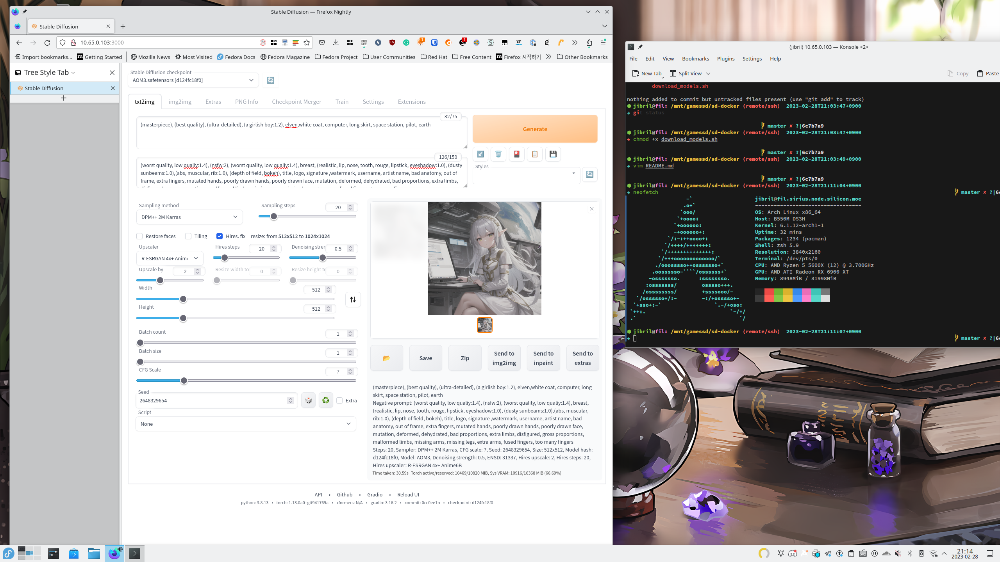

# Stable Diffusion WebUI - ROCm Docker Edition

This project packages AUTOMATIC1111's [Stable Diffusion WebUI](https://github.com/AUTOMATIC1111/stable-diffusion-webui) into AMD ROCm Docker.

Since installing ROCm on not officially supported platforms (e.g. Fedora Linux, Gentoo, Arch, etc) is hard but the kernel driver is already available on everywhere,
packaging userland dependencies into Docker container and running SD-Web on it would simplify the process a lot.

## Requirements

* AMD Graphics card supported by ROCm which has more then 16GB VRAM, such as, but not limited to, AMD Radeon Pro WX 9100 or AMD Radeon RX 6900XT 
* Linux machine which runs decent kernel (>5.10) and Docker (\w compose support)
* Plenty of storage space (SSD preferred)

### AMD Radeon 7900XTX?

As of ROCm 5.4.0, there is no support for 7900XTX ([wait fo ROCm 5.5.0](https://github.com/RadeonOpenCompute/ROCm/issues/1880#issuecomment-1367508214)).
However, there is a github issue comment which says [partial 7900XTX support is landed in ROCm 5.4.2](https://github.com/RadeonOpenCompute/ROCm/issues/1880#issuecomment-1399687459)
(also see guide: [https://github.com/AUTOMATIC1111/stable-diffusion-webui/discussions/8172](https://github.com/AUTOMATIC1111/stable-diffusion-webui/disc))

Unfortunately, I don't own RX7900XTX, so I can not verify weather it runs SD-Webui or not.

## Performance
Measured on ASUS TUF Gaming Radeon RX 6900 XT T16G D6 16GB card.

* AOM3 model, 512x512 image, 32 prompt, 126 negative prompt, DPM++ 2M Karras 20 step - 4.5 second
* Above with Hires. fix \w R-ESRGAN 4x+ Anime6B, 2x scale, 20 hires steps - 30 second

## How to use

1. Clone the repository
2. Run `git submodule update --init --recursive`
3. Run `docker compose build`
4. Run `download_models.sh` or, download the models by hand and put it in `data/models/Stable-Diffusion` directory
5. Run `docker compose up -d`
6. Navigate to [http://localhost:3000](http://localhost:3000) and use it.
